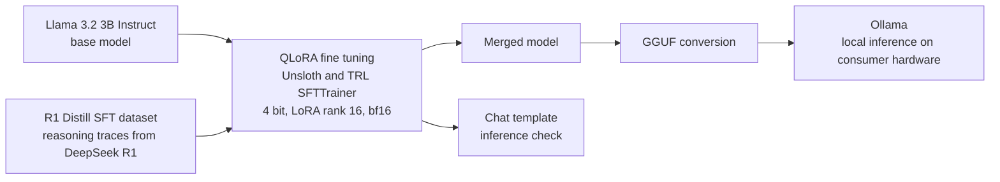

# LLM Reasoning Distillation with QLoRA Fine Tuning

Fine tuning **Llama 3.2 3B Instruct** into a compact reasoning model through supervised fine tuning on **reasoning traces distilled from DeepSeek R1**, then exporting the model to GGUF and serving it locally with Ollama. The project covers the full LLM post training lifecycle: quantized training, inference evaluation, and quantized local deployment.

Notebook: [`finetune_in_unsloth.ipynb`](finetune_in_unsloth.ipynb)

## Architecture

## Pipeline

1. **Base model**: `unsloth/Llama-3.2-3B-Instruct` loaded in 4 bit precision (QLoRA) with [Unsloth](https://github.com/unslothai/unsloth) for memory efficient training on a single GPU
2. **LoRA adapters**: rank 16, alpha 16, applied to every attention and MLP projection layer (`q/k/v/o`, `gate/up/down`), with Unsloth gradient checkpointing
3. **Dataset**: [`ServiceNow-AI/R1-Distill-SFT`](https://huggingface.co/datasets/ServiceNow-AI/R1-Distill-SFT), chain of thought reasoning traces distilled from DeepSeek R1
4. **Prompt engineering**: a custom reasoning template that trains the model to explore, self correct, and refine before answering
5. **Training**: TRL `SFTTrainer` with bf16 precision and gradient accumulation
6. **Inference check**: chat template inference (Llama 3.1 template) on reasoning prompts
7. **Export and serve**: merged LoRA adapters, GGUF conversion, local serving through Ollama

## Why reasoning distillation

Small models do not reason well out of the box. Distilling reasoning traces from a large reasoner like DeepSeek R1 into a 3B model through supervised fine tuning is the cheapest path to a local model that thinks before it answers. The GGUF and Ollama step makes the result runnable on consumer hardware with no cloud dependency.

## Stack

Unsloth · TRL · Transformers · PEFT and LoRA · 4 bit quantization (QLoRA) · Hugging Face Datasets · GGUF · Ollama
